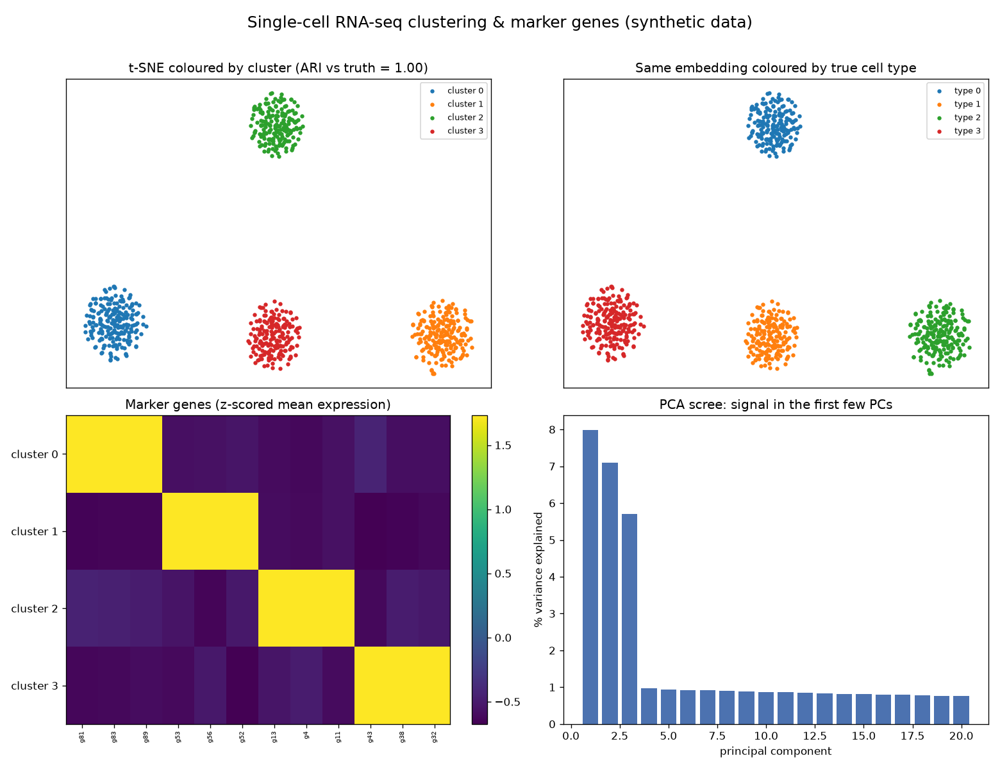

# Single-Cell RNA-seq Clustering & Marker Genes

Bulk RNA-seq averages millions of cells into one number per gene — like measuring a smoothie to learn about fruit. Single-cell RNA-seq measures each cell individually, but hands you a giant, sparse, noisy matrix with no labels. This project is the standard pipeline that turns that matrix into cell types: normalise, reduce, cluster, and name the clusters by their marker genes.

## Demo Output



Produced entirely from a simulated 800-cell × 1,000-gene count matrix by `demo.py` — no downloads. The pipeline recovers the hidden cell types it was never told about (adjusted Rand index vs the truth ≈ 1.0).

## Why This Exists

A single-cell experiment is unsupervised by nature: you know there are distinct cell types in the tissue, but nothing tells you which cell is which. The workflow that solves this — the backbone of Scanpy and the *Orchestrating Single-Cell Analysis with Bioconductor* (OSCA) book — is a specific sequence of steps, and each one exists for a reason:

1. **Normalisation** removes the massive cell-to-cell differences in sequencing depth, so you compare biology, not library size.
2. **Highly variable gene selection** keeps the few hundred genes that actually differ between cells and discards the housekeeping noise.
3. **PCA** compresses those genes into a handful of components that capture the real structure, denoising as it goes.
4. **Clustering** (here k-means on the PCs) groups cells with similar profiles.
5. **Marker detection** finds the genes over-expressed in each cluster — the evidence you use to *name* a cluster a T cell or a macrophage.

Skipping or fumbling any step gives clusters that reflect depth or noise instead of cell identity.

## How It Works

The demo simulates four cell types, each over-expressing its own marker genes, then runs the full pipeline and checks the result:

1. **The t-SNE embedding, coloured by discovered cluster** — the cells fall into clean, separated groups.
2. **The same embedding coloured by true cell type** — the clusters line up with the biology, and the adjusted Rand index quantifies how well.
3. **A marker-gene heatmap** — each cluster lights up its own distinct set of genes, exactly what you would use to annotate it.
4. **The PCA scree plot** — most of the signal lives in the first few components, which is why reducing before clustering works.

## When NOT to Use This

This is a teaching-scale, synthetic pipeline. Real single-cell data needs quality control first (dead cells, doublets, ambient RNA), graph-based clustering (Leiden/Louvain) rather than k-means, and proper differential-expression tests for markers. And t-SNE/UMAP distances between clusters are *not* meaningful — use the embedding to see groups, never to measure how related two groups are. On real data, reach for Scanpy or Bioconductor, not a from-scratch script.

## The Uncomfortable Truth

It is easy to run k-means, get four blobs, and declare four cell types. But clusters are cheap — any algorithm will hand you as many as you ask for. A cluster only means something when it has marker genes you can point to and a biological story behind them. If your "T cells" do not express T-cell markers, you have found a batch effect or a technical artefact, not a cell type.

## Run It

```bash
pip install -r requirements.txt
python demo.py
```

`scrna.py` provides `simulate_counts`, `normalise`, and `highly_variable`.

## Further Reading

Inspired by *Orchestrating Single-Cell Analysis with Bioconductor* (OSCA), freely available at https://bioconductor.org/books/release/OSCA/.

> Demonstrated on synthetic data, so the whole thing is reproducible with no external downloads.
